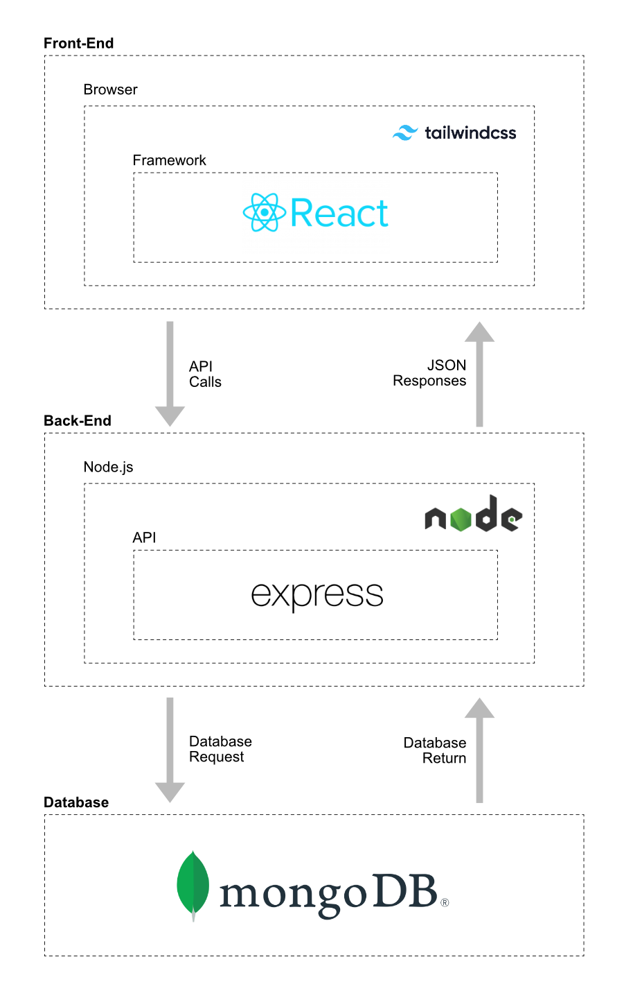

# 🚀 MERN Agenda APP

> **Una agenda de contactos teléfonicos**

Una aplicación web full-stack que permite a los usuarios registrarse y guardar contactos.

[](https://mern-agenda-app-vercel-git-main-carlosgs-projects-0e7da516.vercel.app/login)
[](https://mern-agenda-app.onrender.com/)

---

## ✨ Características Clave

- **Autenticación Robusta:** Registro e inicio de sesión con **JWT** (JSON Web Tokens).
- **CRUD Completo:** Funcionalidad completa de Crear, Leer, Actualizar y Borrar para la entidad principal del proyecto.
- **Diseño Responsivo:** Interfaz optimizada para escritorio y dispositivos móviles.
- **Pruebas End-to-End:** Cobertura de los flujos críticos de la aplicación con **Playwright**.

---

## 🛠️ Stack Tecnológico

El proyecto está construido con la arquitectura **MERN** y utiliza las siguientes herramientas:

### Frontend

- **React:** Librería principal para la interfaz de usuario.
- **Context API:** Gestión del estado global.
- **Tailwind CSS:** Framework utility-first para la estilización rápida y eficiente de componentes.

### Backend & Database

- **Node.js & Express:** Entorno de ejecución y framework para la API REST.
- **MongoDB & Mongoose:** Base de datos NoSQL y modelado de objetos.

### Pruebas y Despliegue

- **Playwright:** Herramienta para la ejecución de pruebas End-to-End.
- **Vercel:** Despliegue del Frontend (Client).
- **Render:** Despliegue del Backend/API (Server).

---

## 🏗️ Arquitectura del Sistema

La aplicación sigue un enfoque de **separación de intereses** con el Frontend (React) actuando como el cliente que consume la API REST alojada en Render.



**Estructura del Repositorio:**

/
|-- client/ # Código React (Frontend)
| |-- src/ # Directorio principal del código fuente
| | |-- components/ # Componentes reutilizables (ej: ProtectedRoute.js)
| | |-- context/ # Manejo del estado global (ej: AuthContext.js)
| | |-- pages/ # Vistas principales de la aplicación
| | |-- services/ # Lógica para peticiones HTTP (fetch/axios)
| |-- tests/ # Pruebas unitarias/integración del frontend
|
|-- server/ # Código Node/Express (Backend API)
| |-- controllers/ # Lógica de negocio (authController.js, contactController.js)
| |-- middleware/ # Funciones que se ejecutan antes de las rutas (ej: auth.js)
| |-- models/ # Esquemas de Mongoose/MongoDB (Contact.js, User.js)
| |-- routes/ # Endpoints de la API (authRoutes.js, contactRoutes.js)
|
|-- docs/ # Archivos de documentación (Diagramas)
| |-- images/ # Imágenes para el README
| |-- mern-agenda-diagram.png # (Diagrama de arquitectura)
|
|-- [Archivos de Configuración]
| |-- .env # Variables de entorno para el backend
| |-- playwright.config.js # Configuración de Playwright
| |-- vercel.json # Configuración de despliegue en Vercel
| |-- README.md # Documentación principal

## 🧪 Pruebas Automatizadas (Playwright)

Las pruebas End-to-End verifican los flujos más importantes del sistema, incluyendo el registro y la interacción CRUD principal.

Para ejecutar las pruebas localmente:

1.  Asegúrate de que el servidor de Node.js esté corriendo.
2.  Instala las dependencias de Playwright:
    ```bash
    npx playwright install
    ```
3.  Ejecuta las pruebas:
    ```bash
    npm run test:e2e
    ```

## ⚙️ Configuración y Ejecución Local

Siga estos pasos para levantar el proyecto en su entorno local:

### 1. Clonar el Repositorio

`bash`
git clone [https://github.com/carlosgarita/mern-agenda-app.git](https://github.com/carlosgarita/mern-agenda-app.git)
cd mern-agenda-app

### 2. Variables de Entorno

**IMPORTANTE:** Por seguridad, cree un archivo `.env` en los directorios `/server` y `/client` (basándose en el `.env.example` proporcionado) y añada las siguientes claves:

| Archivo       | Clave de Ejemplo | Descripción                                     |
| :------------ | :--------------- | :---------------------------------------------- |
| `server/.env` | `MONGO_URI`      | Cadena de conexión a MongoDB.                   |
| `server/.env` | `JWT_SECRET`     | Clave secreta para los tokens de autenticación. |
| `client/.env` | `VITE_API_URL`   | URL de la API: `http://localhost:5001`          |

3. Instalar y Levantar el Backend

cd server
npm install
npm start

# El servidor ahora estará escuchando en http://localhost:5001

4. Instalar y Levantar el Frontend

`bash`
cd client
npm install
npm start

# La aplicación de React se abrirá en http://localhost:3000

💼 Licencia

Este proyecto está liberado bajo la Licencia MIT.
